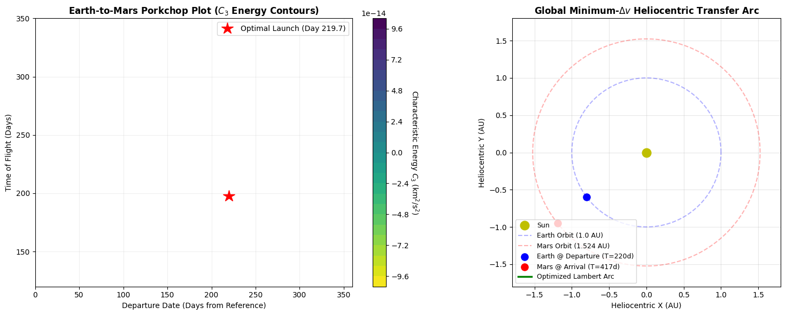

# Automated-Interplanetary-Trajectory-Optimizer
An automated aerospace engineering tool that calculates minimum-energy interplanetary launch windows and Porkchop plots using a universal-variable Lambert solver and differential evolution algorithms.
# Automated Interplanetary Trajectory Optimizer

A computational aerospace engineering tool that automates the discovery of minimum-energy ($\Delta v$) interplanetary launch windows using Lambert's boundary value problem and global optimization algorithms.

## Overview
- **Astrodynamics Framework:** Solves the orbital Boundary Value Problem (BVP) using a robust Universal Variable formulation of Lambert's problem, capable of handling Type I and Type II transfers across elliptical and hyperbolic regimes.
- **Mission Design (Porkchop Plots):** Computes characteristic departure energy ($C_3$) across broad temporal grids to map optimal launch windows (e.g., Earth-to-Mars synodic cycles).
- **Algorithmic Optimization:** Replaces brute-force grid searching with SciPy's `differential_evolution` (a genetic algorithm variant) to automatically converge on the global minimum fuel transfer trajectory without human intervention.

## Governing Mathematics
- **Lambert's Theorem (Universal Variables):**
  $$\Delta t(z) = \frac{1}{\sqrt{\mu}} \left( \left(\frac{y(z)}{C(z)}\right)^{3/2} S(z) + A \sqrt{y(z)} \right)$$
- **Characteristic Departure Energy ($C_3$):**
  $$C_3 = \vert{}\vec{v}_{\text{transfer}} - \vec{v}_{\text{planet}}\vert{}^2$$
  *(Minimizing $C_3$ determines the optimal launch date and time-of-flight).*

## Repository Structure
- `trajectory_optimizer.ipynb`: Python simulation integrating ephemeris state propagation, the universal variable root-finder, and the differential evolution optimizer.
- `earth_mars_porkchop.png`: Dual-panel output visualizing the $C_3$ energy contours (Porkchop plot) alongside the optimized 2D heliocentric transfer arc.
